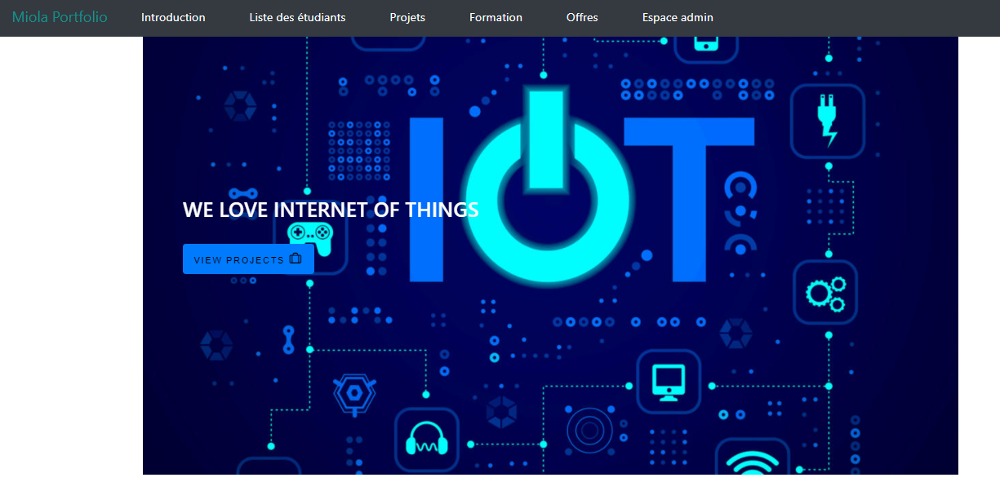
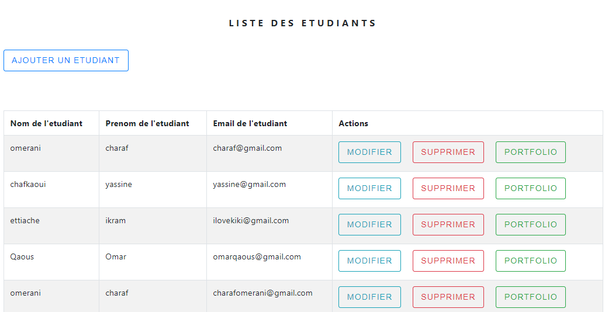
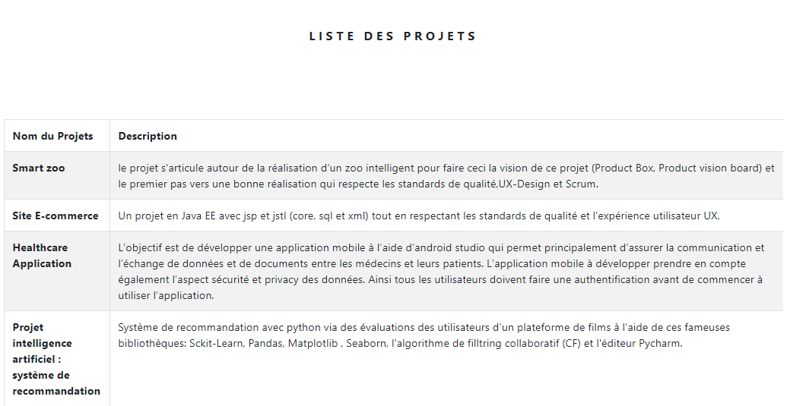
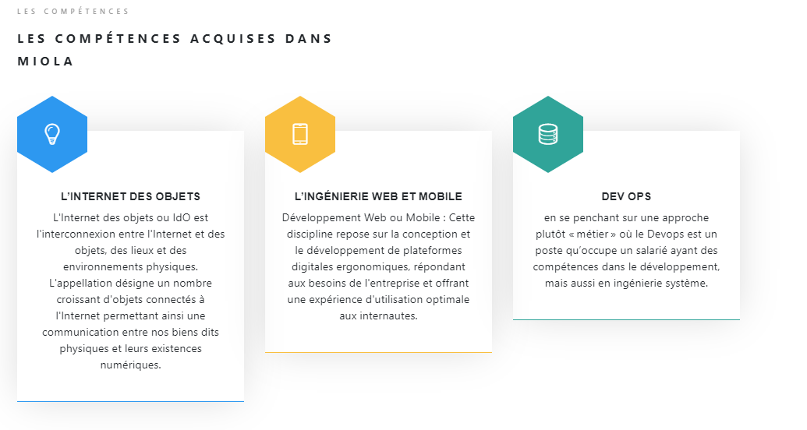
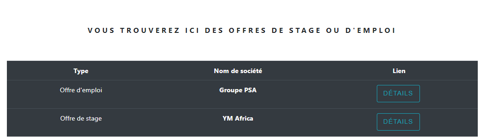

# Description du projet :

****MiolaPortfolio****
Ce projet fullstack est sous forme d'un portfolio qui concerne toutes les compétences acquises par les étudiants durant leur années d'études au master en plus d’assurer leur suivi après. C’est un espace communautaire où on aura la possibilité de recenser les différentes ressources dont on aura besoin pour assurer une bonne continuation et faire en sorte de motiver les nouveaux inscrits et leur permettre de chercher des opportunités que ce soit au niveau des stages ou bien au niveau des recrutements.

# Technologies utilisées :

-****Frontend :****
Bootstrap 4 & React js 

-****Backend :****
Spring boot

-****Methodologie Scrum**** 

-****Material design****

# Aperçu :

